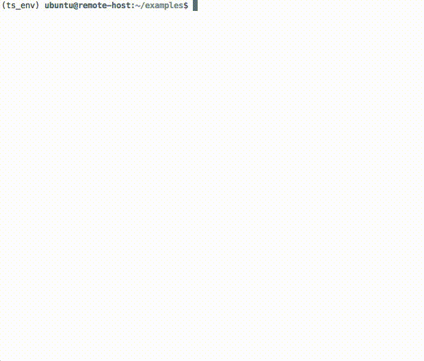

# niicat

This is a tool to quickly preview nifti images on the terminal. 
This can be helpful if you are working on a remote server via SSH and do not have
an -X connection. However, it only works with [iTerm2](https://www.iterm2.com/) 
because it depends on iTerm2's `imgcat` command.

#### Install:

```
pip install niicat
```

#### Usage:




#### This code is based on the following code:

[niipre](https://github.com/vnckppl/niipre)  
[imgcat](https://www.iterm2.com/utilities/imgcat)
