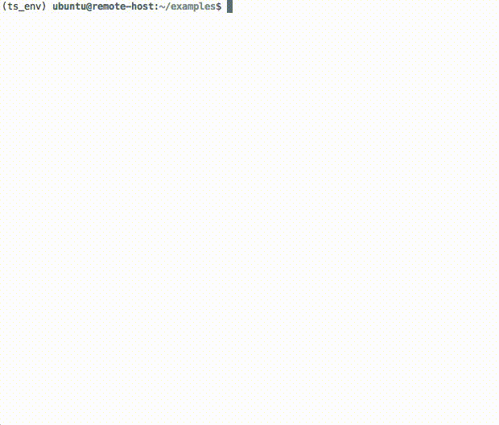

# niicat

This is a tool to quickly preview nifti images on the terminal. 
This can be helpful if you are working on a remote server via SSH and do not have
a -X connection. Per default it uses [libsixel](https://github.com/saitoha/libsixel) to display the images.
If you add the option `-ic` it will use [iTerm2's](https://www.iterm2.com/) `imgcat` command instead of libsixel 
to display the images.


#### Install:

```
pip install niicat
```


### Install prerequisite libsixel (if you do not use iterm2):
Ubuntu
```
sudo apt install libsixel-bin
```

Mac (build from source)
```
git clone https://github.com/saitoha/libsixel.git
cd libsixel
./configure
make
make install
```

Also check out the [terminal requirements](https://github.com/saitoha/libsixel#terminal-requirements) for 
libsixel to work.


#### Usage:

```
niicat T1.nii.gz
```




#### This code is based on the following code:

[niipre](https://github.com/vnckppl/niipre)  
[imgcat](https://www.iterm2.com/utilities/imgcat)
